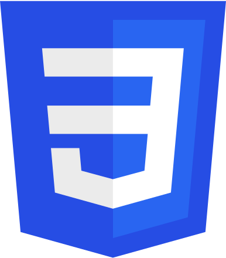
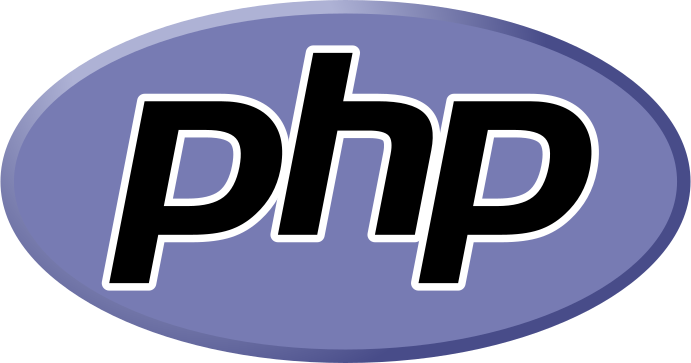
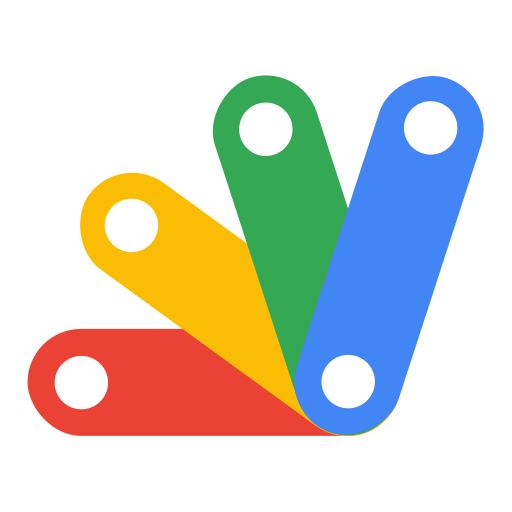

# 👋 Hi there, I'm Fred.   
          
🌱 I learned as a junior web developer [@BeCode.org](https://becode.org/).
I previously worked as draftman in an building dpt, as landsurveyor, and others.
Recently, I started a new path as a software developer.

## Skills 
 
| **Front** |  |  |  |  |  |  |
| :---        |    :----:   |    :----:   |    :----:   |    :----:   |    :----:   |    :----:   |
|**Back**  |  |  |  |  |  |  |
|**Tool**  |  |  |  |  | |  |

#### Some Training

-   [BeCode Learning project](becode-learning.md)
-   [Personal Projects](personal-projects.md)

## Soft skills 

-   Team player
-   Reliable
-   Solution oriented
  

## interests/hobbies:   

-   Cartography enthousiast 🧭📐🗺
-   ultimate 'frisbee' player 🥏   
-   reading :books:   
-   guitars :guitar:
    
 
## How to reach me 

-   [:mailbox:](mailto:fredgaloppin@gmail.com)
-    

